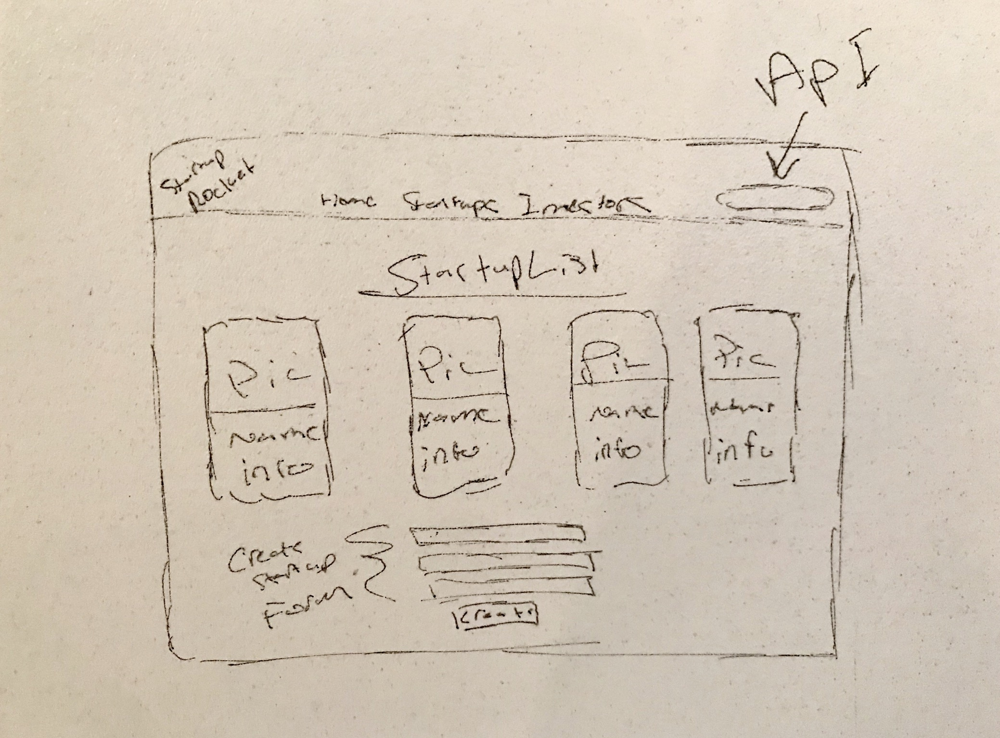
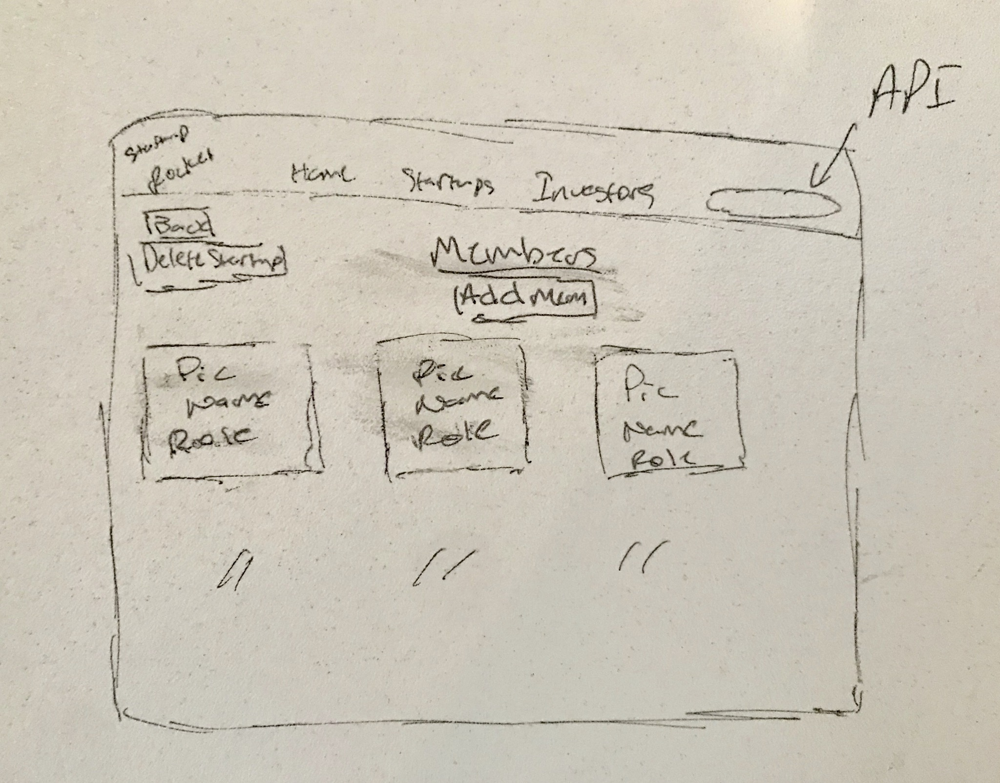
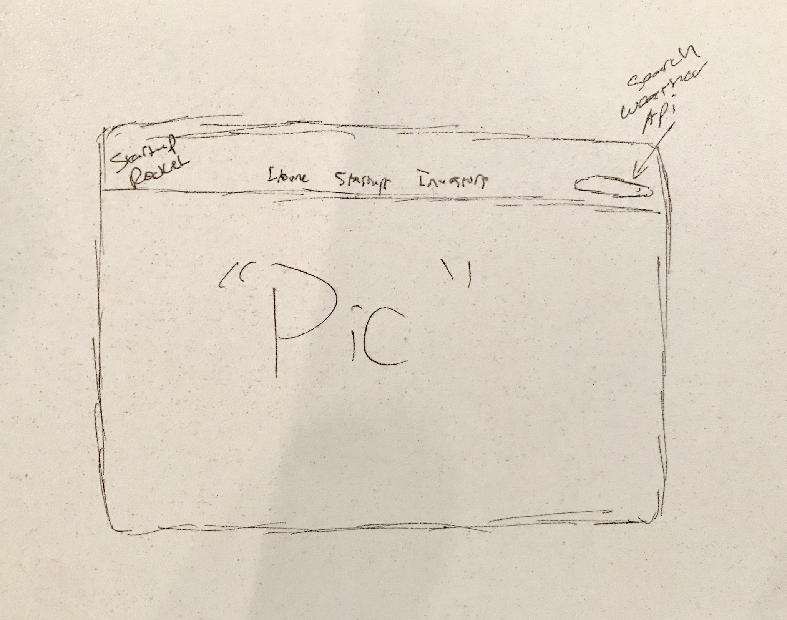
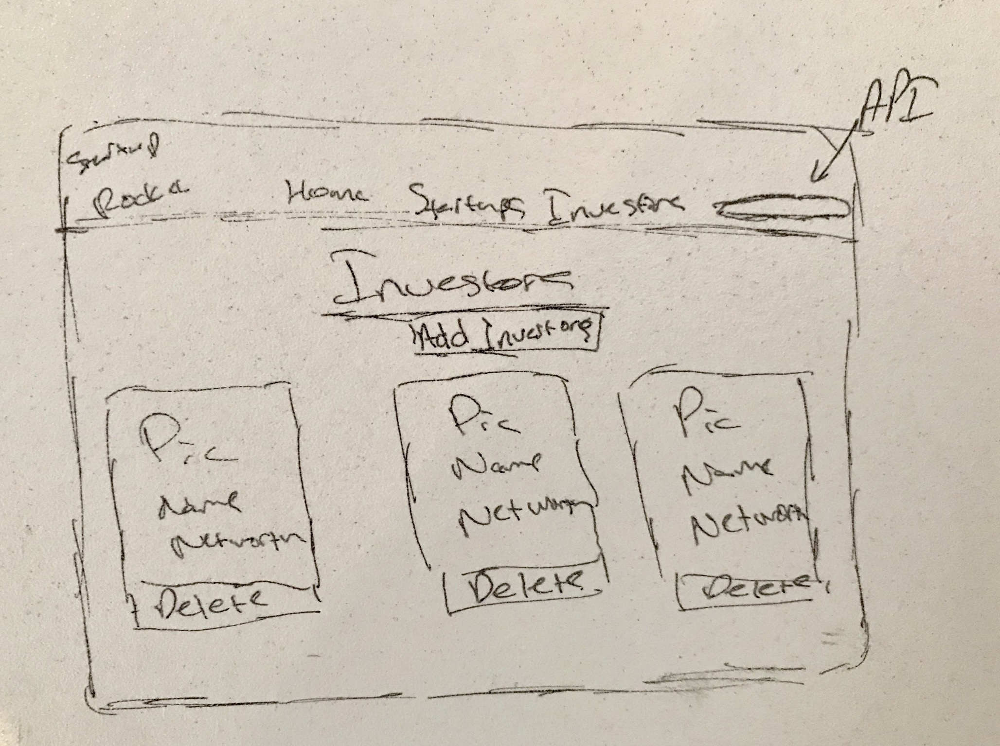
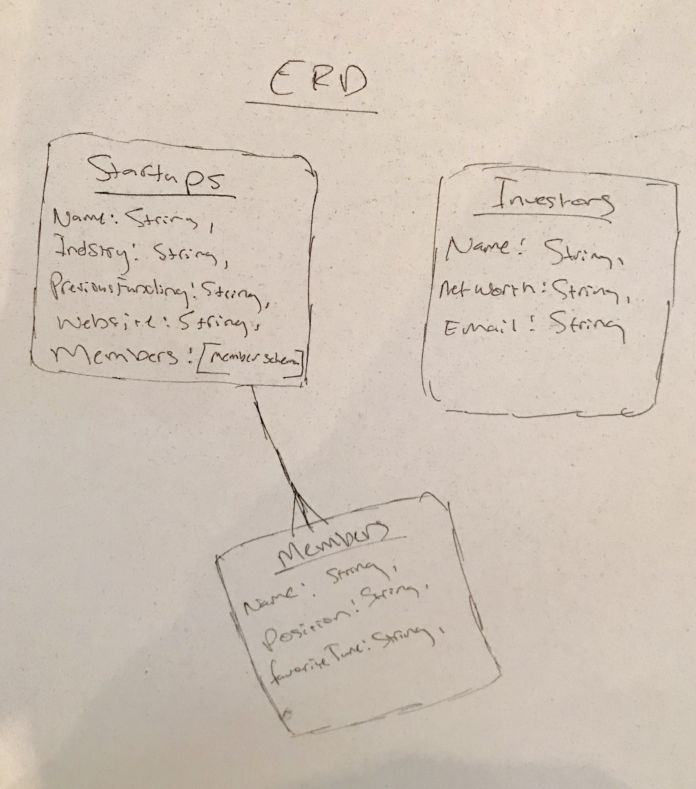

# StartupRocket 

Application for startups that don't have access to funding, and for investors looking for startups to invest in. 

## Technologies Used:
____
* Visual Studio Code
* MongoDB, Expressjs, Node.js - Backend
* Javascript, React.js - Frontend
* Bootstrap, Styled-Components, CSS, Google Fonts (Styling) - Frontend Styling
* axios - Api calls

## Live Deployed Project Link & Trello Board(User Stories)
___
[Heroku](https://startup-rocket.herokuapp.com/)

[Trello](https://trello.com/b/pfS9qd7v/startuprocket)

## Wireframes :
____

## ERD :
___

## Features
___

### Current Features

* Startups can create a new profile with picture, company name, previous funding(yes or no) and website. 
* Investors can add their names to the investor list on the investors page, along with their net worth and email
* Able to click on startups and see theri members and respective positions in the company
* Startup can edit their profile and/or members
* Investors can edit their small profile

### New Features

* Each startup and investor will have their own login authentication
* Investor be able to like a startups profile to show interest
* In app messaging between startups and/or investors
* Startups able to see pictures and more information about investor(picture already in local databse waiting to be called)
* Startups can list their accomplishments, milestones, and/or products and services
