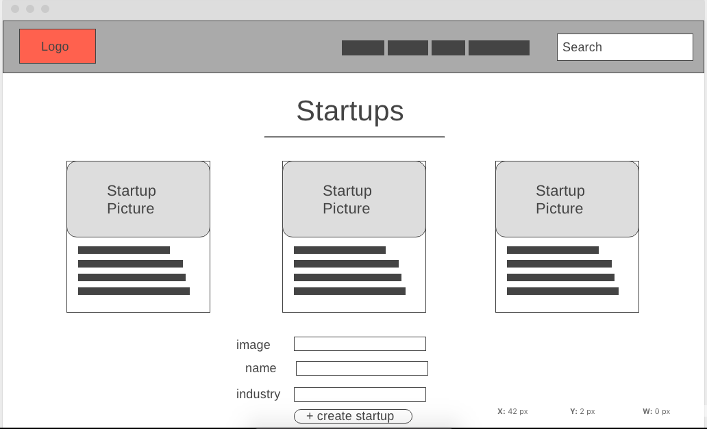
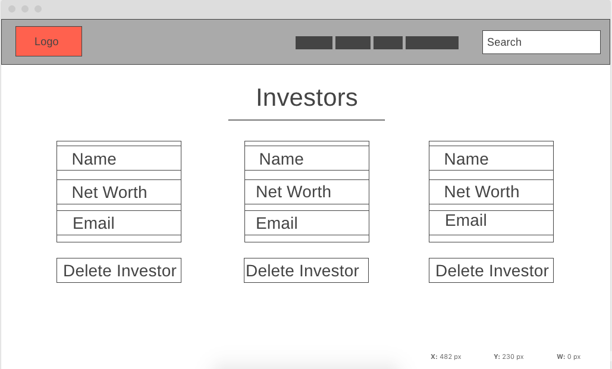
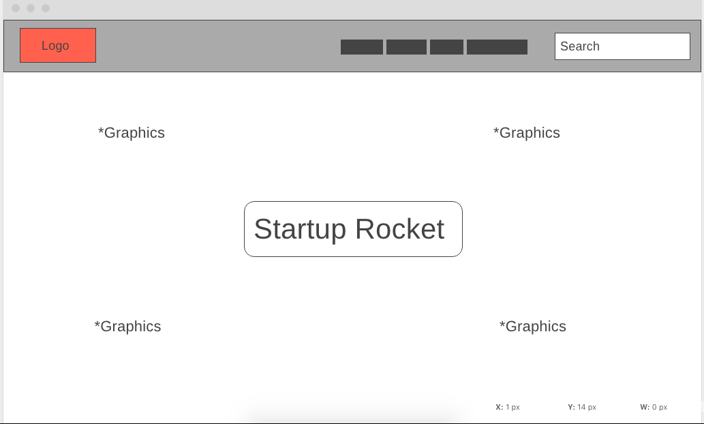
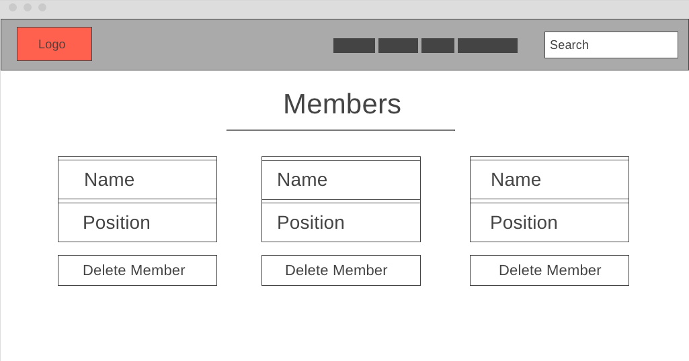
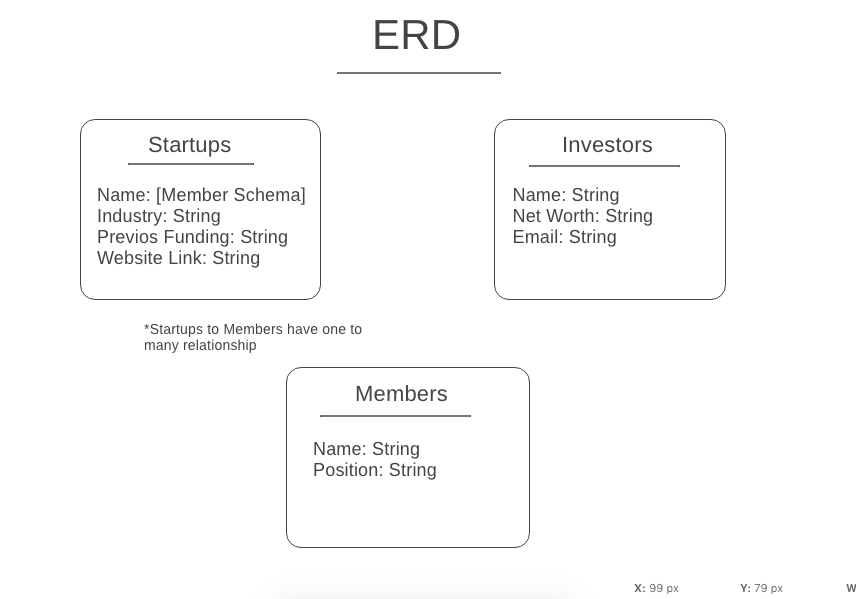
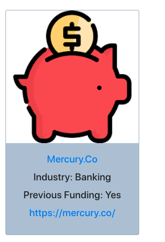
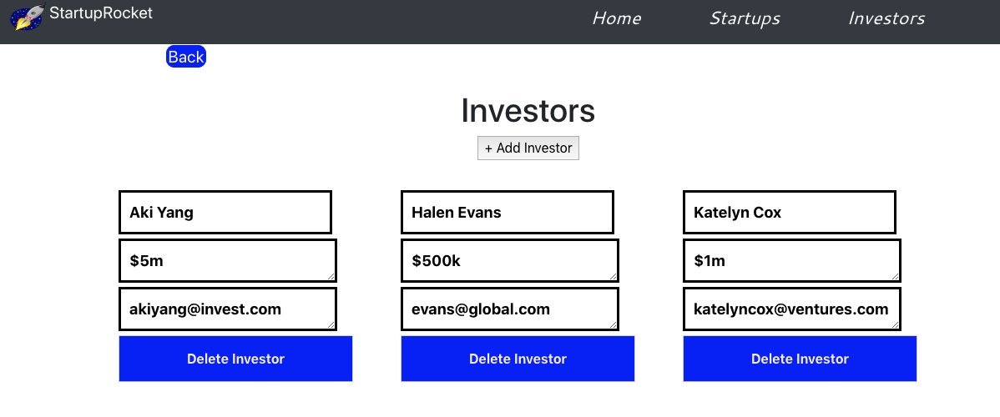

# StartupRocket 

Here is a quick pplication that allows startups that dont have normal access to funding, to connect with investors who are looking to invest in these type of companies. Simple build where you can create startup profiles, add members, and create investors profiles. React Component based application with some advanced onmouseout forms, and bootstrap and react styled components styling for example. 

## Technologies Used:
____
* Visual Studio Code
* MongoDB, Expressjs, Node.js - Backend
* Javascript, React.js - Frontend
* Bootstrap, Styled-Components, CSS, Google Fonts (Styling) - Frontend Styling
* axios - Api calls

## Live Deployed Project Link & User Stories
___
<!-- [Heroku](https://startup-rocket.herokuapp.com/) -->

[Trello](https://trello.com/b/pfS9qd7v/startuprocket)

## Wireframes :
____

## ERD :
___

## Quick Site Glance :
____

## Features
___

### Current Features

* Startups can create a new profile with picture, company name, previous funding(yes or no) and website. 
* Investors can add their names to the investor list on the investors page, along with their net worth and email
* Able to click on startups and see theri members and respective positions in the company
* Startup can edit their profile and/or members
* Investors can edit their small profile

### New Features

* Each startup and investor will have their own login authentication
* Investor be able to like a startups profile to show interest
* In app messaging between startups and/or investors
* Startups able to see pictures and more information about investor(picture already in local databse waiting to be called)
* Startups can list their accomplishments, milestones, and/or products and services
